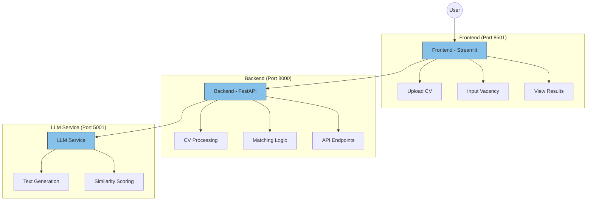

# CV-Vacancy Matcher

A system for matching job candidates with vacancies using AI-powered analysis. The project consists of a FastAPI backend service and a Streamlit frontend application.

### Demo


Watch the demo above to see the CV-Vacancy Matcher in action.

## Design Documentation

For detailed information about the system architecture, components, and technical decisions, please refer to our [Design Document](docs/ml_system_design_doc.md). This document outlines the core system design, architecture decisions, and implementation details for developers and technical stakeholders.

## Repository Structure

```
.
├── data/                   # Dataset storage
├── docs/                   # Documentation files
├── misc/                   # Miscellaneous files and demo assets
├── models/                 # Trained models and artifacts
├── notebooks/             # Jupyter notebooks for analysis
├── src/                   # Source code
│   ├── app/              # Streamlit frontend application
│   ├── benchmark/        # Benchmarking utilities
│   ├── platform/         # Core ML platform code
│   ├── service/          # FastAPI backend service
│   └── training_pipeline/ # Model training pipeline
├── tests/                 # Test suite
├── .pre-commit-config.yaml # Pre-commit hooks configuration
├── docker-compose.yml     # Docker Compose configuration
├── Dockerfile.fastapi     # Backend service Dockerfile
├── Dockerfile.streamlit   # Frontend service Dockerfile
├── pyproject.toml        # Poetry project configuration
└── requirements.txt      # Python dependencies
```

## System Architecture

The system consists of three main components that work together to provide the CV-Vacancy matching functionality:



## Setup and Usage

### Prerequisites

1. Docker and Docker Compose installed on your system
2. LLM Service (e.g., LM Studio) running on port 5001
   - Download and install LM Studio from their official website
   - Load your preferred model (e.g., Mistral-7B)
   - Start the local server on port 5001

### Running the System

1. Clone the repository:
   ```bash
   git clone <repository-url>
   cd <repository-name>
   ```

2. Start the services using Docker Compose:
   ```bash
   docker compose up -d
   ```

   This will start:
   - Frontend (Streamlit) on http://localhost:8501
   - Backend (FastAPI) on http://localhost:8000

3. Access the application:
   - Open your browser and navigate to http://localhost:8501
   - The FastAPI documentation is available at http://localhost:8000/docs

### Direct API Usage Examples (Advanced)

> ⚠️ **Warning**: The system is designed to be used through the Streamlit frontend interface, which provides a complete and user-friendly experience. Direct API usage is not recommended for production use and is provided only for testing, development, or integration purposes.

If you need to interact with the API directly (for testing or development purposes), you can find examples in the `examples/` directory:
- `examples/api_examples.py`: Example code for using each predictor type
- `examples/test_api_examples.py`: Test cases demonstrating API usage
- `examples/README.md`: Detailed documentation on API usage

To run the examples:
```bash
python examples/api_examples.py
```

To run the tests:
```bash
pytest examples/test_api_examples.py -v
```

### Configuration

The system is configured to communicate with the LLM service running on your host machine. The connection is established through:
- Backend environment variable: `LM_API_BASE_URL=http://host.docker.internal:5001/v1`
- Make sure your LLM service (LM Studio) is running and accessible on port 5001

### Stopping the System

To stop all services:
```bash
docker compose down
```
## Development

### Code Quality

We use several tools to maintain code quality:

- isort: Import sorting
- ruff: Linting
- mypy: Type checking
- poetry-export: Dependencies management

Run all pre-commit checks:
```bash
poetry run pre-commit run --all-files
```

Or run individual checks:
```bash
poetry run pre-commit run isort --all-files
poetry run pre-commit run ruff --all-files
poetry run pre-commit run mypy --all-files
poetry run pre-commit run poetry-export --all-files
```

## Testing

Run tests using pytest:
```bash
poetry run pytest
```

## License

This project is licensed under the Creative Commons Attribution 4.0 International License (CC BY 4.0).

This means you are free to:
- Share — copy and redistribute the material in any medium or format
- Adapt — remix, transform, and build upon the material for any purpose, even commercially

Under the following terms:
- Attribution — You must give appropriate credit to the original authors, provide a link to the license, and indicate if changes were made. You may do so in any reasonable manner, but not in any way that suggests the licensor endorses you or your use.

See the [LICENSE](LICENSE) file in the repository root for the full license text.
