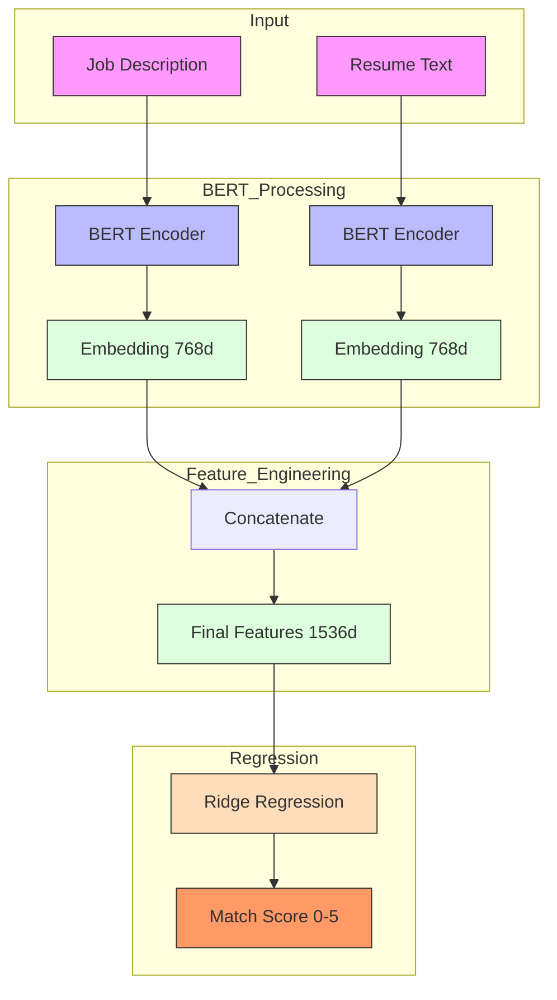

# Baseline Model Evaluation

## Model Architecture

The baseline model consists of two main components:

1. **Text Embedding Model**
   - Model: BERT (bert-base-uncased)
   - Input: Job descriptions and candidate resume texts
   - Output: 768-dimensional embeddings for each text
   - Implementation: Using Hugging Face's transformers library

2. **Regression Model**
   - Model: Ridge Regression
   - Input: Concatenated BERT embeddings (1536 dimensions)
   - Output: Predicted match score (0-5 scale)
   - Hyperparameters: alpha=1.0

### Model Architecture Diagram

## Data Processing
- Maximum sequence length: 512 tokens
- Text preprocessing: BERT tokenization
- Feature engineering: Concatenation of job description and resume text embeddings
- Target variable: Project ratings converted to float (e.g., "4/5" → 0.8)

## Model Performance

### Standard Metrics
| Metric | Training Set | Test Set |
|--------|-------------|-----------|
| MSE    | 0.0274      | 2.2054    |
| R2     | 0.9792      | -0.1170   |

### Custom Accuracy Metrics

#### Training Set Results
- Predictions differing by >1 point: 0.00% (target: ≤5%) ✅
- Predictions differing by >0.5 points: 0.00% (target: ≤20%) ✅
- Meets all requirements: ✅

#### Test Set Results
- Predictions differing by >1 point: 60.00% (target: ≤5%) ❌
- Predictions differing by >0.5 points: 100.00% (target: ≤20%) ❌
- Meets all requirements: ❌

## Analysis

The baseline model using resume text shows similar overfitting issues as the previous version:
1. Strong performance on training data (MSE: 0.0274, R2: 0.9792) but poor generalization to test data
2. Worse test set performance (MSE: 2.2054, R2: -0.1170)
3. The negative R2 score on the test set indicates the model performs worse than a horizontal line
4. The model still fails to meet the custom accuracy requirements on the test set
