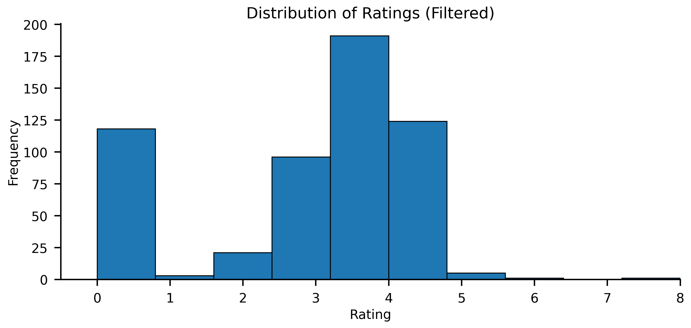

# Exploratory Data Analysis Report

## Dataset Overview

- The dataset contains information about job candidates and their applications, with 1249 entries
- The main task is to predict a rating that indicates how well a candidate's CV matches a job description
+ The key prediction target is the `project_rating` field, which represents expert assessment of candidate-job fit

### Main Fields Relevant for Match Prediction
- `resume_text`: Full text of candidate's CV/resume
- `job_description`: Full text of the job posting
- `project_rating`: Expert-assigned rating of candidate-job match (scale 1-4)
- `tags`: Skills and expertise tags that can help assess match
- `tech_consultant_comment`: Technical reviewer's assessment notes
- Other supporting fields: candidate_name, job_title, status, etc.

## Data Quality

### Missing Values Analysis
Critical fields for match prediction have significant missing data:
- `project_rating`: 519 missing values (41.6%) - This is our target variable
- `resume_text`: 208 missing values (16.7%) - Critical input feature
- `tech_consultant_comment`: 187 missing values (15.0%) - Valuable for understanding expert assessment
- `tags`: 35 missing values (2.8%) - Useful for structured skill matching

Analysis of missing values reveals two main patterns:
1. **Rejection-Related Missing Values:**
   - Technical experts often don't provide ratings when candidates are rejected
   - Missing ratings strongly correlate with `status = 0` (rejection status)
   - This suggests these missing values are not random but systematic

2. **Missing Resume Text:**
   - Applications with missing CV descriptions cannot be used for analysis
   - These samples must be excluded from model training due to missing critical input


*Figure 1: Distribution of missing values across different fields*

### Filtering Strategy
For building a CV-job matching model:
1. Must remove records with missing resume_text as this is a key input
2. For supervised learning:
   - Use only records with project_rating for training
   - Records with missing ratings due to early rejection could potentially be used as negative examples
   - Could potentially use records without ratings for unsupervised pretraining
3. Create features from tech_consultant_comments where available
4. Fill missing tags with empty lists rather than dropping

**Impact of Filtering:**
- Removing samples with missing CV text reduces dataset by ~16.7%
- Additional reduction from missing ratings, but some could be inferred from rejection status
- After applying all filtering criteria, 560 complete entries remain with all required fields
- These 560 samples (~45% of original dataset) will be used for further analysis and model development

## Key Findings

### Rating Distribution
- Project ratings follow a 1-4 scale
- Distribution shows most common ratings are 3 and 4
- Rating appears to capture:
  - Technical skill match
  - Experience level match
  - Overall candidate suitability


*Figure 2: Distribution of project ratings showing preference for higher ratings*

### Status and Rating Analysis

Analysis of final statuses and their corresponding ratings reveals important patterns:

**Most Common Final Statuses (count):**
- Not recommended after resume review (227)
- Recommended after resume review (120)
- Initial contact made (90)
- Shown to client (34)
- Interview stage (26)

**Average Ratings by Status:**
- Initial contact made: 3.82
- Shown to client: 3.74
- Interview stage: 3.65
- Recommended after resume review: 3.63
- Not recommended after resume review: 1.49

**Key Observations:**
- Strong correlation between status and rating
- Clear separation between "recommended" (3.6-3.8) and "not recommended" (~1.5) candidates
- Little differentiation among positive statuses (all around 3.6-3.8)


*Figure 3: Correlation between project ratings and statuses*

**Data Quality Concerns:**
1. Binary-like rating distribution despite 1-4 scale
2. Possible confirmation bias in ratings
3. Limited granularity in distinguishing good candidates

**Recommendations for Data Quality Improvement:**
1. **Additional Annotation:**
   - Consider manual re-annotation of a subset of cases
   - Use LLMs or other AI tools for preliminary scoring
   - Focus on distinguishing between different levels of good matches

2. **Enhanced Rating System:**
   - Develop more detailed rating criteria
   - Consider separate scores for different aspects (technical fit, experience level, etc.)
   - Implement structured scoring rubrics

3. **Interim Approach:**
   - Initially build binary classifier (recommend/not recommend)
   - Use existing ratings for coarse filtering
   - Develop more nuanced models as better data becomes available

### Text Data Analysis
Key sources for matching:
- Resume text: Contains candidate skills, experience, and background
- Job descriptions: Specify required qualifications and responsibilities
- Technical comments: Provide expert insights on match quality


*Figure 3: Word count distributions for resumes and job descriptions*

### Tags Analysis
- Tags provide structured skill information
- Can be used to create explicit skill match features
- Help validate matches found in unstructured text

## Recommendations

1. **Data Preprocessing**:
   - Clean and standardize resume and job description text
   - Extract key sections from resumes (skills, experience, education)
   - Create consistent representation of technical requirements from job posts

2. **Feature Engineering**:
   - Text similarity features between resume and job description
   - Explicit skill match features from tags
   - Experience level matching features
   - Technical keyword matching features
   - Length and complexity metrics for both texts

3. **Model Development**:
   - Frame as regression problem predicting 1-4 rating
   - Consider:
     - Text embedding + similarity approaches
     - Siamese networks for text pair matching
     - Transformer models fine-tuned for text matching
   - Use cross-validation with stratification by rating
   - Evaluate using MSE and correlation metrics

4. **Validation Strategy**:
   - Use tech consultant comments to understand rating decisions
   - Compare model predictions with expert assessments
   - Analyze cases where model and human ratings differ significantly 

## LLM Selection for Automated Rating

Given average input lengths (resume: ~4000 chars, job description: ~3000 chars) and required output (1000 char motivation + rating), we need models with context windows of at least 8-10K tokens. Below is a comparison of potential OSS LLMs:

| Model | Size | Context Window | Resource Requirements | Few-Shot | Estimated Performance | Notes |
|-------|------|----------------|----------------------|----------|---------------------|--------|
| Mistral 7B | 7B | 8K | 16GB GPU | Good (4-8 examples) | High | Best performance/size ratio, good reasoning |
| Llama2 7B | 7B | 4K | 16GB GPU | Good (4-8 examples) | Medium | May need context window extension |
| Llama2 13B | 13B | 4K | 24GB GPU | Very Good (8-12 examples) | High | Better reasoning, needs more resources |
| MPT-7B-Instruct | 7B | 15K | 16GB GPU | Good (4-8 examples) | Medium | Long context but less precise |
| Phi-2 | 2.7B | 2K | 8GB GPU | Limited (2-4 examples) | Low-Medium | Too small context window |
| Yi-6B | 6B | 4K | 14GB GPU | Good (4-8 examples) | Medium-High | Good balance but limited context |
| Mixtral 8x7B | 47B | 32K | 48GB GPU | Excellent (12+ examples) | Very High | Best quality but high requirements |

**Recommendations:**

1. **Primary Choice: Mistral 7B**
   - Good balance of performance and resources
   - Sufficient context window
   - Strong reasoning capabilities
   - Can run on consumer GPUs

2. **High-Resource Option: Mixtral 8x7B**
   - Best performance and longest context
   - Can handle many few-shot examples
   - Requires significant GPU resources

3. **Minimum Viable Option: Yi-6B or Phi-2**
   - Can run on smaller GPUs
   - May need text truncation strategies
   - Limited few-shot capabilities

**Implementation Strategy:**
1. Split long texts into relevant sections
2. Use prompt template with:
   - Key job requirements
   - Candidate's main qualifications
   - 2-4 few-shot examples
3. Request structured output:
   ```
   Rating: [1-4]
   Confidence: [Low/Medium/High]
   Motivation: [Brief explanation]
   Key Matches: [List of matching skills/experience]
   Gaps: [List of missing requirements]
   ```