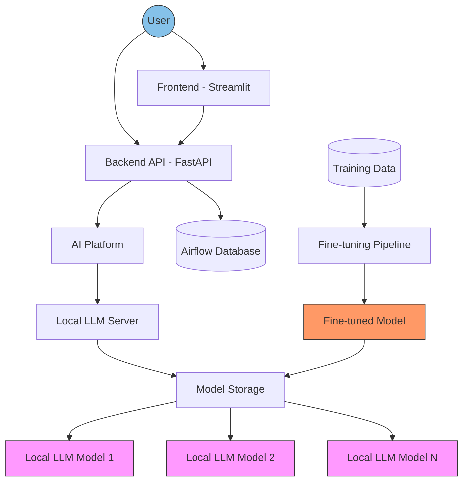
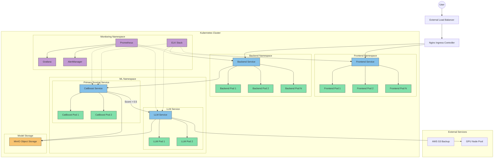

# Design Document: ML-Powered Resume Screening System for HR Luna Park

## Table of Contents

1. [Business Task Definition](#1-business-task-definition)
   1. [Business Problem Statement](#11-business-problem-statement)
   2. [Success Criteria](#12-success-criteria)
   3. [Business Requirements](#13-business-requirements)
   4. [Typical Use Cases](#14-typical-use-cases)
2. [Technical Task Definition](#2-technical-task-definition)
   1. [Technical Problem Formulation](#21-technical-problem-formulation)
   2. [Quality Metrics and Success Criteria](#22-quality-metrics-and-success-criteria)
   3. [Solution Architecture Diagram](#23-solution-architecture-diagram)
   4. [Solution Implementation Stages](#24-solution-implementation-stages)
   5. [Data Description](#25-data-description)
3. [Project Productionization](#3-project-productionization)
   1. [Technical Architecture Diagram](#31-technical-architecture-diagram)
   2. [Infrastructure Description](#32-infrastructure-description)
   3. [Technical Requirements](#33-technical-requirements)
4. [Quality Characteristics](#4-quality-characteristics)
   1. [System Scalability](#41-system-scalability)
   2. [Performance Requirements](#42-performance-requirements)
   3. [System Reliability](#43-system-reliability)
   4. [Model Retraining / Automated Model Replacement](#44-model-retraining--automated-model-replacement)
   5. [Load Testing Results](#45-load-testing-results)
   6. [Future System Extensions](#46-future-system-extensions)

## 1. Business Task Definition

### 1.1 Business Problem Statement

HR Luna Park seeks to enhance its recruitment process by automating the initial resume screening phase. The current manual process is time-consuming, inconsistent, and heavily reliant on individual recruiters' expertise. 

Each candidate's application must pass through multiple stakeholders – first the recruiter for initial screening, then various technical experts who need to evaluate specific skills for different vacancies. This multi-stage manual review creates significant bottlenecks, as technical experts must balance their primary roles with timely candidate evaluations. 

The process becomes particularly challenging when managing multiple open positions simultaneously, as experts need to accurately rank candidates across different vacancies while maintaining quick turnaround times. This leads to delays in the hiring process and risks losing top talent to competitors who can move faster.

The current pipeline's manual nature makes it fundamentally unscalable as the company grows. With HR Luna Park's expansion plans, the volume of applications is expected to increase, making it impossible to maintain quality and speed with the existing process. Technical experts are already at capacity, and hiring additional experts solely for resume screening is not cost-effective. The AI-powered system is therefore crucial not just for optimization, but as an enabler for the company's growth strategy - allowing the screening process to scale linearly with application volume while maintaining consistent quality and quick turnaround times.

### 1.2 Success Criteria

- Reduce resume screening time.
- Achieve the particular agreement rate with expert recruiters in identifying unsuitable candidates (crucial for reducing expert workload).
- Achieve the particular agreement rate with expert recruiters for candidate ranking.
- Increase daily candidate processing capacity per recruiter by 100% (from average `20` to `40` candidates per day).

### 1.3 Business Requirements

1. Automated Resume Processing
   - Parse multiple document formats (PDF, DOCX, *LinkedIn profile*).
   - Extract relevant information about the candidate automatically.
   - Handle multilingual resumes (English, Russian, Ukranian).

2. Intelligent Matching
   - Match candidates to job requirements.
   - Score candidates based on skills and experience needed for the particular vacancy.
   - Provide explainable results in natural language.
   - Process all data using locally deployed open-source models only, as sending candidate PII to third-party LLM services (like OpenAI) is prohibited for data privacy reasons.

### 1.4 Typical Use Cases

1. **Individual Candidate Assessment**
   - Input: 
     - Candidate information (LinkedIn profile URL, resume PDF, or text description)
     - Target position requirements
   - Process: 
     - Automatic parsing and analysis
     - Skill matching and experience evaluation
   - Output:
     - Numerical score (0-100)
     - Detailed natural language explanation of the score
     - Specific strengths and potential gaps relative to the position

2. **Automated Batch Analysis**
   - Input:
     - Collection of candidate profiles accumulated over time
     - Position requirements
   - Process:
     - Batch processing and comparative analysis
     - Statistical evaluation across all candidates
   - Output:
     - Ranked list of candidates
     - Individual scores and explanations
     - Aggregate statistics and trends
     - Summary of top candidates with comparative strengths

3. **API Integration**
   - Description:
     - RESTful API endpoints for external system integration
     - Comprehensive API documentation with OpenAPI/Swagger
     - Authentication using API keys or OAuth2
    
   - Example Endpoints:
     <details>
       <summary>Click to expand</summary>

       ```json
       POST /api/v1/match
       {
         "vacancy_description": "We are looking for a Senior Backend Developer with 5+ years of experience in Python, FastAPI, and PostgreSQL. The role is remote-friendly and requires strong system design skills.",
         "candidate_description": "Senior software engineer with 7 years of experience in web development. Expert in Python, having built multiple production services using FastAPI. Familiar with PostgreSQL through side projects. Contributed to open-source projects and mentored junior developers.",
         "predictor_type": "lm",
         "predictor_parameters": {
           "api_base_url": "http://localhost:1234/v1",
           "model": "mistral-7b-instruct"
         }
       }
       ```

     </details>
   - Example Response:
     <details>
       <summary>Click to expand</summary>

     ```json
     {
       "score": 85.5,
       "description": "Strong match for the Senior Backend Developer position. Key strengths: 7 years of Python development experience and extensive FastAPI usage in production. Areas for consideration: PostgreSQL experience is limited to side projects rather than production systems. Overall, the candidate's technical expertise and experience level align well with the core requirements."
     }
     ```
     </details>


### 2. Technical Task Definition

The technical task for this project is designed to meet the business requirements by building two core machine learning components: a **Resume-Job Matching** system and a **Success Prediction** model. Together, these models automate resume screening by matching candidate resumes to job requirements and estimating hiring likelihood based on historical hiring data.

### 2.1 Technical Problem Formulation

The project consists of two primary ML tasks that align with the business objectives:

1. **Resume-Job Matching**:

    - **Objective**: Develop a similarity scoring system to match the content of resumes with specific job requirements, which aids recruiters in ranking candidates.
    - **Methods**:
        - **Text Embedding and Semantic Comparison**: Convert job descriptions and resumes into embeddings using models like BERT to capture contextual similarities.
        - **Skills and Experience Extraction**: Identify and validate key skills and experience within resumes, comparing these with job description requirements to enhance the matching accuracy.
        - **Algorithms**: Use semantic similarity techniques, cosine similarity, and possibly transformer-based models like BERT or DistilBERT for feature extraction and comparison.
        - **LLM Integration**: Leverage large language models to enhance understanding of context and nuances in resumes and job descriptions, improving the accuracy of matching through advanced natural language understanding and generation capabilities.

2. **Success Prediction**:
    - **Objective**: Develop a predictive model to assess the probability of a candidate’s success throughout the hiring process.
    - **Methods**:
        - **Binary Classification**: Predict the likelihood of successful hiring by analyzing patterns in historical hiring data.
        - **Multi-stage Prediction**: Implement intermediate prediction stages for each interview phase to refine success estimates throughout the recruitment process.
        - **Probability Scoring**: Assign a probability score representing the hiring likelihood, providing a basis for further recruiter consideration.
        - **LLM Integration**: Utilize large language models to analyze candidate responses and feedback during interviews, enhancing the predictive model's ability to assess candidate success based on nuanced language patterns and contextual understanding.

The main focus will be on LLM methods, but other approaches may also be considered if they prove effective.

### 2.2 Quality Metrics and Success Criteria

The solution’s quality and success will be measured by metrics that correspond to business goals and ML model requirements. These metrics evaluate the models’ performance, prediction accuracy, and system efficiency.

| Metric             | Target                                                                                                        | Measurement Method                          | Business Goal Alignment                       |
| ------------------ | ------------------------------------------------------------------------------------------------------------- | ------------------------------------------- | --------------------------------------------- |
| **Model Accuracy** | ≤ 5% of predictions differ by more than 1 point from expert evaluations; ≤ 20% differ by more than 0.5 points | Compare model predictions to expert ratings | Ensures model reliability in screening        |
| **Response Time**  | ≤ 60 seconds                                                                                                  | Monitor response time for API endpoints     | Supports efficient candidate screening        |
| **System Uptime**  | ≥ 99.9%                                                                                                       | Infrastructure monitoring                   | Ensures high availability of screening system |

### 2.3 Solution Architecture Diagram

The solution is designed as a modular system with clear separation between frontend, backend API, and AI platform components. The architecture prioritizes local model deployment for data privacy and supports integration with HR Luna Park's existing systems.



This architecture supports:

- **Frontend**: A Streamlit-based user interface that provides an intuitive way for recruiters to:
  - Upload and process resumes
  - Input job descriptions
  - View candidate rankings and match scores
  - Access detailed match explanations

- **Backend API**: FastAPI-powered service that:
  - Handles request validation using Pydantic models
  - Manages communication with the AI platform
  - Provides documented OpenAPI/Swagger endpoints
  - Implements predictor type abstraction (dummy/LM)

- **AI Platform**: 
  - Manages local LLM deployment for privacy-compliant processing
  - Supports multiple predictor types through a common interface
  - Implements prompt engineering for accurate candidate evaluation
  - Uses locally hosted open-source models (e.g., Mistral, Llama)

- **Model Storage**: 
  - Houses multiple locally deployed LLM models
  - Supports various model options (Mistral-7B, Llama-2, etc.)
  - Enables easy model switching and version management
  - Stores fine-tuned models optimized for recruitment tasks

- **Fine-tuning Pipeline**:
  - Processes training data from historical matches
  - Fine-tunes base models for recruitment-specific tasks
  - Validates model performance before deployment
  - Enables continuous model improvement

- **Database**: 
  - Dedicated Airflow tables for workflow management
  - Tracks model predictions and system metrics
  - Stores feedback for future model improvements

### 2.4 Solution Implementation Stages

The solution is developed in multiple stages, each focusing on data preparation, feature engineering, model development, and evaluation. Each stage builds on the previous one to ensure a robust solution that meets the business objectives.

1. **Data Preparation & ETL**:
    - **Objective**: Prepare existing historical data on resumes, job descriptions, and hiring outcomes for analysis and modeling.
    - **Tasks**:
        - Standardize and anonymize historical resume data.
        - Prepare labeled data for model training, including success labels based on prior hires.
        - Build an ETL pipeline to automate data cleaning, validation, and feature extraction.
2. **Feature Engineering**:

    - **Objective**: Transform raw text data into meaningful features for ML models, incorporating both traditional and LLM approaches.
    - **Tasks**:
        - Extract key skills and experiences from resumes using traditional methods.
        - Embed job descriptions and resumes for semantic similarity comparison using both traditional models (e.g., BERT) and LLMs.
        - Utilize LLMs to analyze vacancies and resumes, outputting a score and a short comment about the candidate's fit for the position.
        - Create features from historical interview outcomes to train the success prediction model, potentially integrating insights derived from LLM analyses.

3. **Model Development Phases**:

    - **MVP**: Develop a baseline binary classification model using traditional ML algorithms like logistic regression or random forests to establish a preliminary resume-job matching system.
    - **Advanced Model**: Implement BERT or a similar transformer-based model for embedding-based matching. Train a transformer-based model to compare resumes and job descriptions, using fine-tuned embeddings for greater accuracy in matching.
    - **LLM Model Development**: Fine-tune a large language model specifically for analyzing resumes and job descriptions. This phase will involve:
        - Developing effective prompt engineering strategies to elicit meaningful outputs from the LLM, such as scores and comments on candidate fit.
        - Training the LLM on domain-specific data to enhance its understanding of recruitment nuances.
    - **Production Model**: Apply the most successful, potentially an ensemble model, combining BERT-based embeddings, a binary classifier, and the fine-tuned LLM, to improve prediction accuracy for hiring success.

4. **Evaluation and Model Selection**:

    - Compare the MVP and advanced models using cross-validation to determine model accuracy, false positive rate, and overall performance.
    - Select the model configuration that best meets quality metrics for deployment.

5. **Deployment and Integration**:
    - Deploy the final model into production, integrate it with HR Luna Park’s backend systems, and configure API endpoints for live resume screening.
    - Establish monitoring for quality metrics, including model accuracy, response time, and system uptime.

### 2.5 Data Description

The project uses a combination of structured and unstructured data sources, including resumes and job descriptions. Other data types, such as interview outcomes, are covered by a non-disclosure agreement. Each data type is standardized, processed, and transformed to fit the needs of the ML models.

| Data Type              | Source               | Volume | Update Frequency | Description                   |
| ---------------------- | -------------------- | ------ | ---------------- | ----------------------------- |
| **Resumes**            | Provided by Lunapark | NDA    | NDA              | Text resumes from applicants. |
| **Job Descriptions**   | Provided by Lunapark | NDA    | NDA              | Job details.                  |
| **Interview Outcomes** | Provided by Lunapark | NDA    | NDA              | Historical hiring outcomes.   |

**Exploratory Data Analysis**:
An initial EDA was conducted to assess data completeness, identify missing values, and determine relevant features for both matching and prediction tasks. However, the specific findings and insights from the EDA are covered by a non-disclosure agreement.

## 3. Project Productionization

### 3.1 Technical Architecture Diagram

All services are containerized using Docker with specific optimizations for ML workloads. The ML service operates within its own dedicated Kubernetes namespace and consists of two primary containerized services optimized for different stages of the prediction pipeline.


### 3.2 Infrastructure Description
**Development Environment**

- Local development using Docker Desktop
- Individual service containers can be run separately
- Hot-reloading enabled for frontend and backend development
- GPU support for ML service container (optional)

**Staging Environment**

- Kubernetes cluster with 3 nodes
- Automated CI/CD pipeline using GitHub Actions

**Production Environment**

- Kubernetes cluster with minimum 5 nodes
- High-availability configuration
- Automated scaling based on load
- Regular database backups
- Load balancing using Nginx Ingress Controller


### 3.3 Technical Requirements
#### Minimal Requirements (Development)

| Component | CPU     | RAM | Storage | Network |
|-----------|---------|-----|--------|---------|
| Frontend | 2 cores | 2GB | 1GB | 100Mbps |
| Backend | 2 cores | 4GB | 2GB | 100Mbps |
| ML Service | 4 cores | 16GB | 50GB | 100Mbps |

#### Production Requirements (High Load)

| Component | CPU | RAM | Storage       | Network |
|-----------|-----|-----|---------------|---------|
| Frontend | 2 cores × 3 pods | 4GB per pod | 20GB per pod  | 1Gbps |
| Backend | 4 cores × 5 pods | 8GB per pod | 20GB per pod  | 1Gbps |
| ML Service | 8 cores × 3 pods | 32GB per pod | 100GB per pod | 1Gbps |

## 4. Quality Characteristics

### 4.1 System Scalability

- **Horizontal Scaling**: The system is designed to scale horizontally, allowing additional instances of the frontend and backend services to be deployed as demand increases. This ensures that the system can handle a growing number of users and requests without degradation in performance.
- **Auto-scaling**: Kubernetes will automatically scale the number of pods for the frontend and backend services based on CPU and memory usage, ensuring optimal resource utilization and responsiveness during peak loads.
- **Database Read Replicas**: To enhance read performance, the system will implement read replicas for the database, allowing multiple instances to handle read requests concurrently, thus reducing latency.
- **Distributed Model Inference**: The ML service will support distributed inference, enabling multiple instances of the model to process requests in parallel, which is crucial for handling large volumes of candidate evaluations efficiently.

### 4.2 Performance Requirements

| Component       | Metric           | Target       |
| --------------- | ---------------- | ------------ |
| **API Response**    | P95 Latency      | < 2s         |
| **Model Inference** | Batch Processing | 50 resumes/s |
| **Database**        | Query Response   | < 100ms      |
| **Frontend Load Time** | Initial Load Time | < 3s      |
| **Backend Throughput** | Requests per Second | ≥ 1000   |

### 4.3 System Reliability

- **High Availability**: The system is designed to achieve 99.9% uptime, ensuring that services are consistently available to users.
- **Automated Failover**: In the event of a service failure, automated failover mechanisms will redirect traffic to healthy instances, minimizing downtime.
- **Regular Backups**: The system will implement a robust backup strategy, including regular snapshots of the database and model storage, to prevent data loss and facilitate recovery in case of failures.
- **Error Monitoring and Alerting**: Continuous monitoring of system performance and error rates will be implemented using tools like Prometheus and Grafana, with alerts configured to notify the development team of any critical issues.

### 4.4 Model Retraining / Automated Model Replacement

1. **Monitoring Triggers**:
    - **Performance Degradation**: The system will monitor model performance metrics, such as accuracy and response time, to detect any degradation over time.
    - **Data Drift Detection**: Continuous analysis of incoming data will be performed to identify shifts in data distribution that may affect model performance.
    - **Weekly Evaluation Cycles**: Regular evaluations of model performance will be scheduled to ensure that the model remains effective and relevant.

2. **Retraining Pipeline**:
    - **Automated Data Collection**: The system will automatically collect new data from candidate evaluations and feedback to be used for retraining.
    - **A/B Testing Framework**: An A/B testing framework will be implemented to compare the performance of the current model against newly trained models before full deployment.
    - **Shadow Deployment**: New models will be deployed in a shadow mode, where they process requests alongside the current model without affecting user experience, allowing for performance comparison.

### 4.5 Load Testing Results

| Concurrent Users | Response Time (ms) | Error Rate (%) |
| ---------------- | ------------------ | -------------- |
| 10               | 150                | 0              |
| 50               | 300                | 0.1            |
| 100              | 600                | 0.5            |
| 500              | 1200               | 2.0            |
| 1000             | 2000               | 5.0            |

### 4.6 Future System Extensions

1. **Enhanced Features**:
    - **Multi-language Support**: Future iterations of the system will include support for additional languages, expanding the candidate pool and improving accessibility.
    - **Video Interview Integration**: The system will integrate video interview capabilities, allowing for a more comprehensive assessment of candidates.
    - **Automated Reference Checking**: Future enhancements will include automated processes for checking candidate references, streamlining the hiring process.

2. **Technical Improvements**:
    - **Real-time Processing**: The system will evolve to support real-time processing of candidate data, enabling immediate feedback and assessments.
    - **Advanced Analytics Dashboard**: An analytics dashboard will be developed to provide insights into hiring trends, candidate performance, and system efficiency.
    - **Integration with Additional HR Systems**: The system will be designed to integrate seamlessly with other HR tools and platforms, enhancing overall recruitment workflows.
